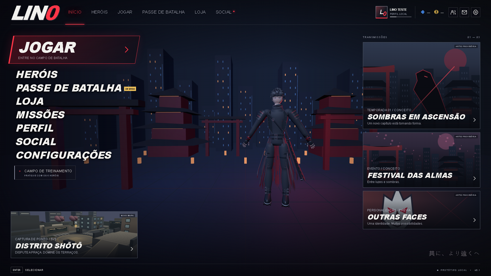
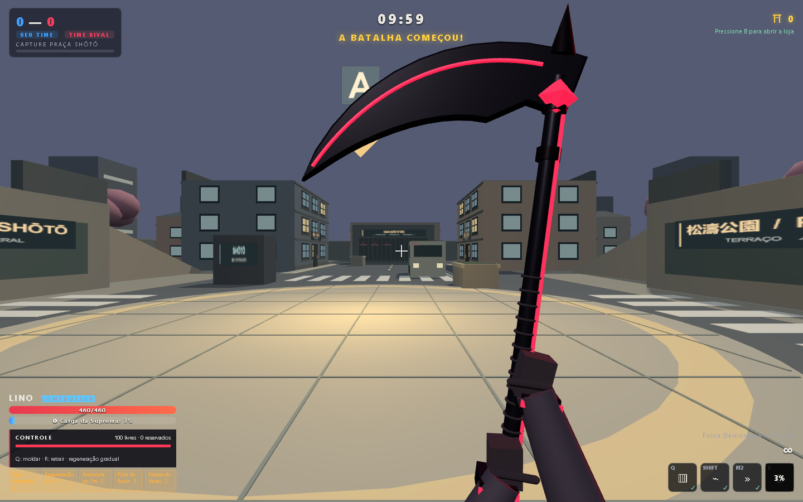
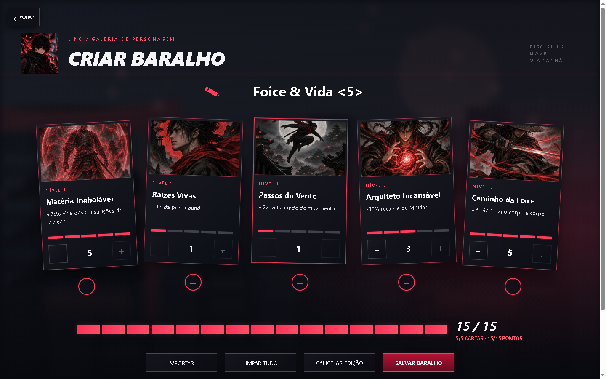

# LIN0 — Web Hero Shooter

**Escolha seu herói. Monte seu baralho. Controle o campo de batalha.**

Hero shooter em primeira pessoa para navegador, desenvolvido com **TypeScript, Three.js e Vite**. Um protótipo jogável com partidas locais **5v5 contra bots**, habilidades próprias por personagem, mapas tridimensionais e personalização por cartas.

[Começar](#executar-localmente) · [Imagens](#imagens-do-projeto) · [Controles](#jogar) · [Documentação](#documentação) · [Reportar problema](https://github.com/VtecturboBr/LIN0---Web-Hero-Shooter-Game/issues)



> **Em desenvolvimento.** O jogo funciona localmente, sem servidor de partidas. As capturas mostram versões de desenvolvimento; modelos, interface e balanceamento podem diferir do código publicado. Modo online, cosméticos, passe de batalha e serviços sociais ainda não estão implementados.

## O que você encontra

- **Combate 5v5 com bots:** habilidades, supremas, projéteis, efeitos de status e loja de itens durante a partida.
- **Seis personagens:** Lino, Yume, Raijin, Kitsune, Shin e Kenji, com galeria, habilidades e cartas próprias.
- **Lino, o Arquiteto do Abismo:** foice, estruturas destrutíveis, fio de movimentação e dash para controlar espaço e mobilidade.
- **Dois modos:** Conquista, com disputa de ponto, e Duelo Shogun, com pontuação por eliminações.
- **Mapas e treinamento:** Distrito Shōtō, Castelo do Shogun e um campo para testar dano, cura e movimentação.
- **Baralhos personalizados:** 20 opções de cartas por personagem, nove espaços de baralho e cinco cartas por combinação.
- **Persistência local:** baralhos e preferências ficam salvos no navegador.

## Imagens do projeto

### Combate no Distrito Shōtō

Perspectiva em primeira pessoa com a foice de Lino, ponto de captura e indicadores de combate.



### Personalização por cartas

Cada baralho combina cinco cartas diferentes, com níveis de 1 a 5 e um total de 15 pontos.



## Executar localmente

Tenha **Node.js 22 LTS com npm**, Git e um navegador desktop com WebGL. Use teclado e mouse para jogar.

Clone o repositório e instale as dependências:

```bash
git clone https://github.com/VtecturboBr/LIN0---Web-Hero-Shooter-Game.git
cd LIN0---Web-Hero-Shooter-Game
npm ci
npm run dev
```

Abra o endereço informado pelo Vite, normalmente `http://localhost:5173`. Entre em uma partida ou no campo de treinamento; clique na área do jogo para capturar o mouse.

Para gerar e conferir a versão de distribuição:

```bash
npm run build
npm run preview
```

O build verifica os tipos TypeScript e gera os arquivos estáticos em `dist/`. Abra o endereço exibido pelo comando de preview.

## Onde encontrar cada coisa

```text
src/
├── characters/       Uma pasta por personagem: definição, cartas e apresentação
├── maps/             Um diretório por mapa, construção do mundo e colisões
├── game/             Partidas, modos, bots, jogador, combate e efeitos
├── progression/      Catálogo de cartas, baralhos salvos e loja de itens
├── ui/               Menu, galeria, seleção de partida, baralhos, HUD e estilos
├── core/             Tipos compartilhados, entrada, áudio e relógio
└── main.ts           Inicialização, renderização e ligação entre telas e partida

public/assets/        Imagens servidas pelo jogo, agrupadas por personagem e finalidade
tests/unit/           Testes de regras e simulação
tests/browser/        Verificação do jogo no Chrome
scripts/              Ferramentas de desenvolvimento e execução dos testes
docs/                 Guias de organização e documentação dos mapas
```

**Comece pelo [guia de organização](docs/structure.md)**: ele mostra os arquivos exatos para alterar vida, habilidades, cartas, portraits, mapas e menus.

**F3 abre as ferramentas de desenvolvimento** durante partidas e treinamento: stats, comandos, dummies, baralhos temporários, IA e desempenho. Veja [runtime de combate e Dev Mode](docs/runtime-and-dev-mode.md) para os controles, eventos, status e decisões de integração.

## Jogar

**Jogar → modo e mapa → personagem → baralho salvo → combate.**

Edite os baralhos em **Heróis → personagem → Baralhos**. Cada personagem tem 20 opções de cartas e nove espaços de baralho. Cada baralho contém cinco cartas diferentes, com níveis de 1 a 5 e soma de 15 pontos. A escolha confirmada dentro da partida fica bloqueada até o fim dela.

Os mapas de partida são Distrito Shōtō e Castelo do Shogun. O **campo de treinamento** pode ser aberto pelo início, pela página Jogar ou pela galeria. Ele possui alvos inimigos, aliados para testar cura e prédios para testar mobilidade.

| Ação | Controle |
| --- | --- |
| Movimento / salto | WASD / Espaço |
| Ataque principal | Clique esquerdo |
| Lino: Moldar / Fio do Abismo / dash | Q / segurar Shift / botão direito |
| Lino: selecionar forma / criar / retrair | Números com Moldar aberto / clique esquerdo / R |
| Outros personagens: habilidades | Q / botão direito / F |
| Suprema | E |
| Outros personagens: recarregar / ataque alternativo / corpo a corpo | R / botão do meio / V |
| Pausa / placar / loja da partida | Esc / segurar Tab / B nas áreas permitidas |
| Treinamento: painel / recuperar / reiniciar | T / G / N |

Baralhos e preferências são salvos neste navegador. Limpar os dados do site remove esses dados locais.

## Verificar alterações

```bash
npm test                 # Todas as suítes de regras e simulação
npm run test:lino        # Kit de Lino
npm run test:map         # Colisão, navegação e captura
npm run test:combat      # Disparos, projéteis e registro de acertos
npm run test:loadouts    # Cartas, níveis, salvamento e migração
npm run typecheck        # Verificação de tipos sem gerar o build
npm run build            # TypeScript e distribuição
npm run test:browser     # Fluxo de partida no Chrome; requer Vite rodando
```

Veja [os testes no navegador](tests/README.md) para validar galeria, portraits, treinamento e outros fluxos. As capturas são gravadas em `artifacts/browser/`, ignorado pelo controle de versão. `dist/` também é gerado; ambos podem ser recriados.

## Documentação

- [Organização do projeto](docs/structure.md): onde alterar personagens, habilidades, cartas, mapas e menus.
- [Combate e ferramentas de desenvolvimento](docs/runtime-and-dev-mode.md): eventos, status e painel acessível por F3.
- [Distrito Shōtō](docs/shoto-map.md): estrutura e decisões do mapa.
- [Testes](tests/README.md): suítes de simulação e verificações no Chrome.
- [Recursos visuais](public/assets/README.md): organização das imagens utilizadas pelo jogo.

## Contribuir

Abra uma [issue](https://github.com/VtecturboBr/LIN0---Web-Hero-Shooter-Game/issues) com passos para reproduzir o problema, resultado esperado e navegador utilizado. Capturas ajudam em problemas visuais.

Para alterações de código, consulte o guia de organização, mantenha o escopo focado e execute os testes relevantes e `npm run build`. Mudanças de interface também devem ser conferidas no navegador.
